# Prediction-of-music-popularity
Semestrálny projekt z princípov dátovej vedy v 3 ročníku. Skupina: Galková, Polašková, Bednáriková, Kováčová.

## Motivácia
Cieľom tejto analýzy je pochopiť, aké faktory ovplyvňujú popularitu skladieb a využiť tieto poznatky na vytváranie predikčných modelov, ktoré dokážu presne odhadnúť úspešnosť skladieb.

V súvislosti s touto témou sme si stanovili hlavné otázky, na ktoré na konci odpovieme:
1. **Závisí popularita od interpreta?**
2. **Od akých parametrov závisí popularita?**
3. **Ktorý model je lepší na predikciu (binárny/nebinárny) a ktorý model je najlepší?**

   
# Datasety
Pre analýzu sme zvolili dataset zo stránky Kaggle ([Spotify Audio Features Dataset](https://www.kaggle.com/datasets/tomigelo/spotify-audio-features)), ktorý obsahuje 17 premenných umožňujúcich analyzovať faktory ovplyvňujúce popularitu skladieb. Dataset je dostatočne rozsiahly, obsahuje **130 325 záznamov**, čo zvyšuje presnosť a spoľahlivosť našej analýzy. Popisy jednotlivých premenných sme doplnili informáciami z oficiálnej stránky Spotify.  
Okrem základného datasetu sme použili aj **druhý zdroj** ([Spotify Top Artists](https://kworb.net/spotify/artists.html?fbclid=IwZXh0bgNhZW0CMTEAAR2Bj_U0gmgjHBn6Jt3GguG1NYRDpiOLfWvMPkm4bsX1qQZp67yvIKbOv5E_aem_VB5DyAuSgFdu2WpySSbD0Q)), ktorý hodnotí popularitu interpretov na Spotify. Tento zdroj sme vybrali s predpokladom, že popularita skladby úzko súvisí s popularitou interpreta.

### Spracovanie interpretov
Aby sme interpretov reprezentovali kvantitatívnou premennou namiesto kategórie (mena interpreta), priradili sme im hodnotu popularity podľa počtu streamov:
- Dataset obsahuje **3 000 najpopulárnejších interpretov**, zoradených podľa celkového počtu prehratí.
- Interpretom sme priradili pozíciu v rebríčku (zoradenú vzostupne). Najpopulárnejší interpret získal hodnotu **3 000**, menej populárni interpreti nižšie hodnoty.
Spojili sme oba datasety a obmedzili analýzu len na skladby interpretov z **top 3 000**. Po odstránení duplicít v stĺpci `track_id` (identifikátor pesničky) sme pracovali s **29 281 záznamami**. 

### Problémy v dátach
Premenná **popularity** nie je rovnomerne rozdelená. Väčšina skladieb má nižšiu popularitu, čo môže viesť k tomu, že model sa viac prispôsobí skladbám s nižšou popularitou a bude mať problémy s identifikáciou skladieb s vyššou popularitou. Z tohto dôvodu sme pridali nový stĺpec klasifikujúci skladby ako **populárne** alebo **nepopulárne**.
Aby sme skladbu mohli označiť ako populárnu alebo nepopulárnu, rozhodli sme sa pracovať s hodnotou popularity ako **binárnou premennou**. Prahová hodnota bola stanovená na úrovni **75% kvantilu popularity (hodnota 53)**: Skladby s hodnotou popularity ≥ 53 sme označili za **populárne** (top 25%). Týmto sme pripravili základ pre klasifikačné metódy.
 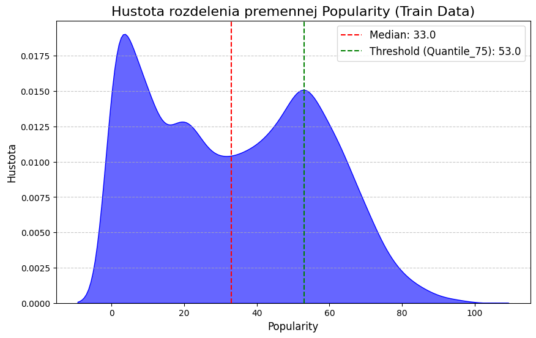

### Korelačná analýza
  
Pre analýzu korelácií sme zvolili **Spearmanovu koreláciu**, ktorá lepšie zachytáva nelineárne vzťahy. Výrazné korelácie sme pozorovali pri:
**1. Pozitívne korelácie**

- **Popularity vs. Artists** (ρ = 0.39)  
  Popularita mierne rastie pri lepšom rankingu interpretov. Najpopulárnejšie skladby patria často interpretom s najlepším umiestnením. Populárnejší umelci majú tendenciu vydávať skladby s vyššou popularitou, čo je očakávaný jav..

- **Popularity vs. Energy** (ρ = 0.45)  
  Popularita rastie s energiou skladby, no graf je roztrúsený. Menej výrazný vzťah.

- **Popularity vs. Danceability** (ρ = 0.48)  
  Skladby s vyššími hodnotami danceability majú vyššiu šancu stať sa populárnymi.

- **Popularity vs. Loudness** (ρ = 0.58)  
  Vidíme jasný pozitívny vzťah medzi hlasitosťou a popularitou. Skladby, ktoré sú hlasnejšie (hodnoty dB bližšie k 0), majú tendenciu byť populárnejšie

**2. Negatívne korelácie**

- **Popularity vs. Instrumentalness** (ρ = -0.40)  
  Väčšina populárnych skladieb má nízku inštrumentálnosť. Vidíme slabú negatívnu koreláciu – čím vyššia je inštrumentálnosť, tým nižšia je popularita skladieb.

- **Popularity vs. Acousticness** (ρ = -0.47)  
  Vysoká akustickosť je častejšie spojená s nižšou popularitou.
  
 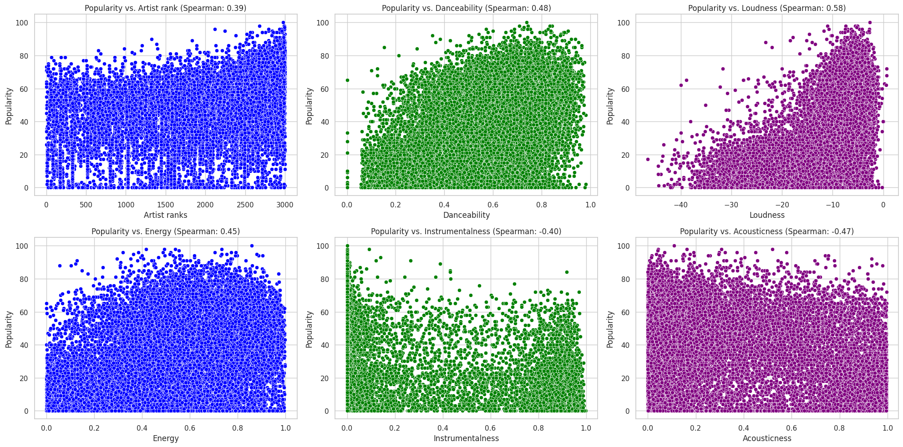
---

# Predikčné Modely

Dáta sme spracovali pomocou štyroch rôznych metód a porovnali ich výsledky na testovacom súbore.

### Regresné Metódy
Cieľom bolo predikovať hodnotu popularity. Aby sme ich mohli porovnať s klasifikačnými metódami, odhad sme považovali za správny, ak bol v tolerancii **±5** od skutočnej hodnoty.
- **Lineárna regresia**
- **KNN regresia**

### Klasifikačné Metódy
Cieľom bolo predikovať popularitu skladby ako **binárnu premennú** (`popularity_bin`), kde skladby označujeme za populárne, ak patria do top 25 %.
- **Logistická regresia**
- **KNN klasifikácia**
- **Rozhodovací strom**

## Lineárna Regresia

Najskôr sme sa zamerali na analýzu popularity pomocou lineárnej regresie. Tento model pracuje so stĺpcom **popularity** (nie s binárnym stĺpcom `popularity_bin`), pretože lineárna regresia nie je vhodná na binárne klasifikácie – na tento účel sa používa logistická regresia (viď nižšie). Implementáciu lineárnej regresie sme postupne zlepšovali pomocou cross-validácie. Keďže je veľmi náročné predpovedať presnú hodnotu popularity na úroveň percenta, zaviedli sme toleranciu ±5, ktorú považujeme za prijateľný odhad (tolerancia sa uplatňuje pri výpočte presnosti).

### Kroky

### Príprava Dát
1. **Odstránenie stĺpcov**: Odstránili sme stĺpce ako `duration_ms`, `key` a `tempo`. Na základe korelačnej matice sme zistili, že tieto premenné nemajú významný vplyv na model a ich zahrnutie by ho zbytočne komplikovalo. Na transformáciu dát sme sa rozhodli použiť PowerTransformer, ktorý je veľmi užitočný pri práci s dátami, ktoré môžu obsahovať negatívne hodnoty. Táto technika pomáha stabilizovať rozptyl a normalizovať dáta, čím sa model stáva robustnejší a presnejší. Data sme nakoniec este aj preskalovali z dovodu aby všetky premenné majú rovnakú váhu v rámci modelu.

#### Optimalizácia Modelu
1. **Cross-validácia**: 
   - Optimalizovali sme počet foldov v rámci cross-validácie. Najlepšie výsledky sme pozorovali pri **40 foldoch**, kde sa **Mean Squared Error (MSE)** stabilizovalo.

2. **Regularizácia (Lasso regresia)**:
   - Pri optimalizácii parametra `alpha` pre Lasso regresiu, ktorý znižuje riziko overfittingu, sme zistili, že najlepšie výsledky dosahuje najnižšia hodnota `alpha`. To naznačuje, že regularizácia neprináša výrazný prínos. Preto sme sa rozhodli Lasso regresiu nepoužiť.

3. **Polynomiálna transformácia**:
   - Na základe grafu sme zistili, že dáta nie sú lineárne, a preto sme aplikovali polynomiálnu transformáciu až do tretieho stupňa. Všetky tieto optimalizácie sme implementovali a aplikovali na testovaciu množinu.

### Výsledky
Podarilo sa nám znížiť hodnotu MSE na testovacej sade z pôvodných **298.8** na **256.1**, čo predstavuje zlepšenie o takmer **15 %**. Toto zlepšenie hodnotíme pozitívne. Napriek tomu je predpoveď stále ďaleko od použiteľnej presnosti. Model nám poskytol zaujímavé poznatky o vzťahoch medzi premennými a potvrdil, že lineárna regresia nie je správnym modelom pre tieto dáta. 

#### Poznatky o vplyve premenných
- **Pozitívny vplyv na popularitu**: `danceability` , `artist_rank` , `loudness` 
- **Negatívny vplyv na popularitu**: `acousticness`, `energy`, `instrumentalness`, `speechiness`

#### Hodnotenie presnosti
Aby sme mohli porovnať náš model s inými prístupmi, rozhodli sme sa použiť metódu presnosti (**accuracy**). Lineárna regresia je v tomto prípade v nevýhode, pretože na rozdiel od iných modelov nepracuje s binárnou premennou `popularity_bin`, ale s reálnou hodnotou popularity. To si vyžaduje veľmi presné predpovede.

Zaviedli sme toleranciu ±5, v rámci ktorej považujeme predikciu za správnu. Aj napriek tejto tolerancii sme dosiahli len **25,7 % presnosti**, čo nie je uspokojivý výsledok. Preto sme sa rozhodli zmeniť prístup a zamerať sa na klasifikáciu.

## Logisticka Regresia

Cieľom je vytvoriť model, ktorý dokáže spoľahlivo rozlíšiť medzi populárnymi a menej populárnymi piesňami. Pieseň definujeme ako populárnu, ak jej kvantilová hodnota dosahuje alebo prekračuje 75 %. Túto informáciu reprezentujeme binárnou premennou `popularity_bin`, kde:
- **1** označuje populárnu pieseň
- **0** označuje menej populárnu pieseň.

Na základe širokého spektra hudobných atribútov, ako sú tanečnosť, energia a akustickosť, sme zvolili logistickú regresiu ako vhodný nástroj pre túto binárnu klasifikáciu. Logistická regresia umožňuje odhadnúť pravdepodobnosť, že daná pieseň patrí do kategórie populárnych.

### Úprava dát
Pôvodný dataset bol značne nevyvážený v prospech triedy menej populárnych piesní. Aby sme zabránili zaujatosti modelu, použili sme techniku **SMOTE (Synthetic Minority Oversampling Technique)**. Táto metóda synteticky generuje nové príklady pre menšinovú triedu na základe existujúcich dát, čím sme zabezpečili rovnomerné zastúpenie oboch tried.

### Výsledky modelu

| Metrika       | Hodnota  |
|---------------|----------|
| **Presnosť**  | 73 %     |
| **Precision** | 55 %     |
| **Recall**    | 75 %     |
| **F1-score**  | 63 %     |

Model dosiahol prijateľnú celkovú presnosť (73 %), avšak detailnejšia analýza odhalila rozdiely vo výkone medzi jednotlivými triedami.

### Výkonnosť podľa tried

#### Trieda 0: Menej populárne piesne
- **Precision**: Vysoká, čo znamená, že väčšina piesní označených ako „menej populárne“ je správna.
- **Recall**: 72 %, čo ukazuje, že model správne identifikuje väčšinu menej populárnych piesní.

#### Trieda 1: Populárne piesne
- **Precision**: 55 %, teda niečo vyše polovice piesní označených ako „populárne“ je skutočne populárnych.
- **Recall**: 75 %, čo znamená, že model dokáže identifikovať väčšinu populárnych piesní.

## Matica zámien (Confusion Matrix)

|                 | Predikované menej populárne | Predikované populárne |
|-----------------|-----------------------------|-----------------------|
| **Nepopulárne** | 2907 (True Negatives)     | 1113 (False Positives) |
| **Populárne**      | 467 (False Negatives)      | 1370 (True Positives)  |

### ROC krivka a AUC
**ROC krivka** graficky zobrazuje vzťah medzi True Positive Rate (Recall) a False Positive Rate pri rôznych prahových hodnotách klasifikácie.
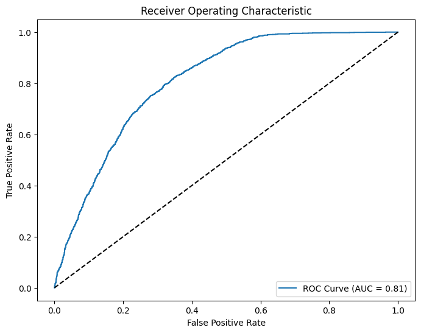

- **AUC (plocha pod krivkou):** 0.81  
Táto hodnota naznačuje veľmi dobrý výkon modelu pri rozlišovaní medzi populárnymi a menej populárnymi skladbami.

### Precision-Recall krivka
**Precision-Recall krivka** ukazuje vzťah medzi presnosťou (precision) a úplnosťou (recall) pri rôznych prahoch klasifikácie.

- Na začiatku krivky, keď je recall nízky, model dosahuje veľmi vysokú presnosť. Znamená to, že model je v tomto režime opatrný a označuje za populárne iba piesne, o ktorých je veľmi presvedčený.
- So zvyšovaním recall (snaha identifikovať viac populárnych piesní) dochádza k poklesu presnosti, pretože model začne nesprávne označovať niektoré piesne ako populárne.
- **Priemerná presnosť (AP):** 0.60, čo naznačuje uspokojivý, ale nie výnimočný výkon modelu.
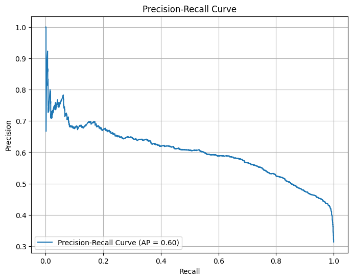

Výsledky modelu logistickej regresie s **ROC-AUC 0.81** a presnosťou **73 %** naznačujú solídny výkon, najmä pri klasifikácii menej populárnych piesní. Model dokáže identifikovať väčšinu populárnych piesní (vysoký recall), avšak nižšia presnosť naznačuje určité problémy pri správnom určení populárnych skladieb.

---

## Rozhodovací strom

V tejto implementácii sme použili klasifikačný rozhodovací strom na analýzu dát, pričom sme sa zamerali na optimalizáciu jeho výkonu pomocou prerezávania. Rozhodovacie stromy často trpia problémom pretrénovania, keďže model zachytáva šum v dátach. Preto sme  neskor aplikovali techniku prerezávania, ktorá umožňuje zjednodušenie modelu odstránením nepotrebných uzlov.

### Výsledky neprerezaného modelu

Použili sme klasifikačný rozhodovací strom s maximálnou hĺbkou 10 a vyvážením tried pomocou parametra `class_weight='balanced'`. Ak by tento parameter nebol nastavený, model by predpokladal, že všetky triedy majú rovnakú váhu, bez ohľadu na ich početnosť v dátach. To znamená, že dominantná trieda by mala vyššiu prioritu a model by sa snažil minimalizovať chyby na početnejšej triede, čo by viedlo k tomu, že by zase ignoroval menej početne triedy.

### Trénovacie dáta
| Metrika                          | Hodnota   |
|-----------------------------------|-----------|
| **Tréningová presnosť**          | 74.50 %   |
| **Recall (citlivosť) pre triedu 1** | 96 %      |
| **Precision (presnosť) pre triedu 1** | 51 %   |
| **F1-score pre triedu 1**         | 0.66      |

- Náš model dokáže zachytiť takmer všetky populárne skladby (recall), čo je zásadné pre náš cieľ.
- Model má pri predikcii triedy 1 viac falošne pozitívnych prípadov (Precision), teda nepopulárne skladby označí ako populárne. Toto je problém.
- **F1-score pre triedu 1**: 0.66 – ukazuje, že model má slušný balans medzi presnosťou a citlivosťou pri predikcii populárnych skladieb.
Celkový výkon modelu na dátach je slušný, no nie perfektný.

### Testovacie dáta
| Metrika                          | Hodnota   |
|-----------------------------------|-----------|
| **Recall (citlivosť) pre triedu 1** | 87 %      |
| **Precision (presnosť) pre triedu 1** | 46 %    |
| **F1-score pre triedu 1**         | 0.60      |
| **Celková presnosť**             | 69.6 %    |

- Aj na nových dátach model zachytí väčšinu populárnych skladieb (Recall). Model spoľahlivo zachytáva väčšinu populárnych skladieb, čo je kľúčové pre náš cieľ.
- **Celková presnosť**: 69.6 % – výkon modelu na testovacích dátach je primeraný, hoci hlavný dôraz je na triedu 1.
- Relatívne nízka presnosť pre triedu 1 (51 % na tréningových a 46 % na testovacích dátach) signalizuje, že model často označuje nepopulárne skladby ako populárne, čo by mohlo byť zlepšené ďalším ladením.

### ROC-AUC krivka
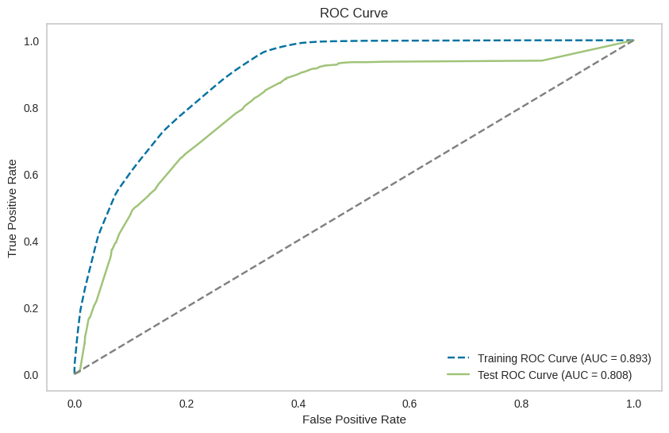
- **AUC skóre pre tréningovú množinu**: 0.893 – Model má veľmi dobrú schopnosť odlišovať medzi triedami na tréningových dátach. AUC hodnota 0.893 naznačuje, že model efektívne zachytáva rozdiely medzi populárnymi a nepopulárnymi skladbami počas tréningu.
- **AUC skóre pre testovaciu množinu**: 0.808 – Výkon modelu na testovacích dátach je stále dobrý, ale mierne slabší ako na tréningových dátach. Tento rozdiel (0.085) naznačuje, že model nie je výrazne pretrénovaný a dokáže generalizovať na nové dáta.

#### Tvar ROC kriviek
- Tréningová krivka je bližšie k hornému ľavému rohu, čo značí vyššiu citlivosť pri zachovaní nízkeho množstva falošne pozitívnych predikcií.
- Testovacia krivka je podobná, no mierne posunutá nižšie – model na testovacích dátach niekedy generuje viac falošne pozitívnych predikcií.

### Tvar rozhodovacieho stromu
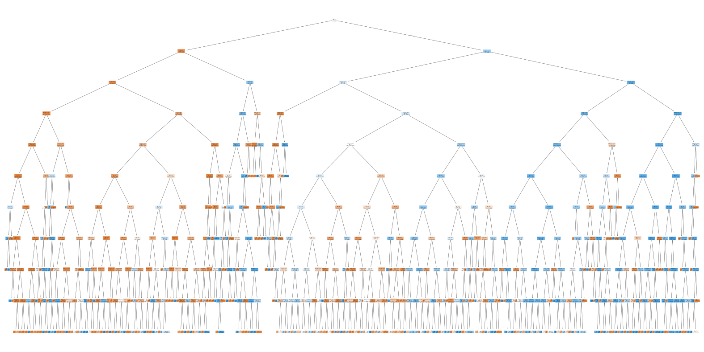
Strom má veľkú hĺbku a je komplikovaný. To môže byť dôvodom mierneho pretrénovania. Orezanie by mohlo výkon takéhoto komplexného stromu zlepšiť. Model bol na testovacich datach príliš komplexný a mierne prispôsobený detailom trénovacích dát, čo znížilo jeho schopnosť generalizovať na nové dáta.
Aby sme tento problém vyriešili, pristúpili sme k prerezávaniu stromu pomocou techniky nákladovej komplexnosti (cost complexity pruning). Cieľom je odstrániť zbytočné uzly stromu a dosiahnuť jednoduchší, robustnejší model.

- **Hľadanie parametra alpha**: Hľadáme hodnotu alfa, ktorá vyváži nízku nečistotu a zjednodušenie stromu. 
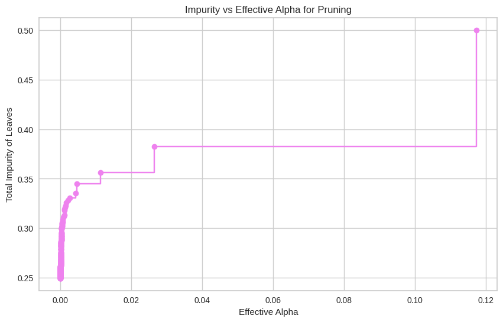
- Os X - Hodnota alfa, ktorá určuje mieru prerezávania. Čím je hodnota vyššia, tým viac vetiev sa odstráni.
- Os Y - celková nečistota listov stromu. Táto hodnota narastá s rastúcou hodnotou alfa, pretože odstránením vetiev dochádza k zjednodušeniu stromu, ale zároveň k zníženiu schopnosti stromu prispôsobiť sa trénovacím dátam.

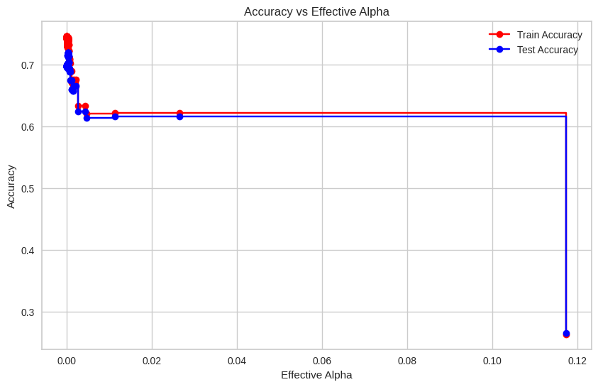
Tento graf zobrazuje závislosť medzi hodnotou `ccp_alpha` (parametra pre prerezávanie rozhodovacieho stromu) a presnosťou modelu na tréningových a testovacích dátach.

- Pri nízkych hodnotách alfa je model pretrénovaný, čo vedie k vysokej presnosti na tréningových dátach, ale slabšej na testovacích.
- Pri veľmi vysokých hodnotách alfa dochádza k underfittingu, keď je strom príliš zjednodušený a nedokáže zachytiť dôležité vzory v dátach.
Zvolíme hodnotu `ccp_alpha` v rozsahu 0.01 - 0.03, kde model dosahuje najlepšiu rovnováhu medzi presnosťou na tréningových a testovacích dátach.

### Vizualizácia optimálneho zrezaného stromu
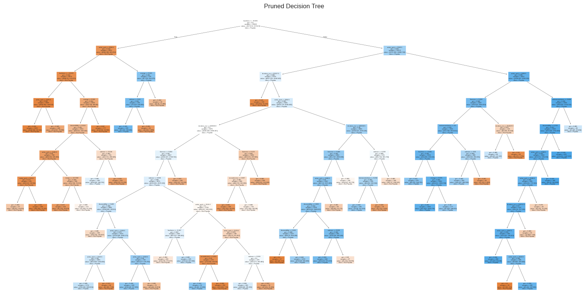
- Prerezaný strom neobsahuje nepodstatné vetvy a je menej komplexný. Výsledkom je model, ktorý je ľahšie interpretovateľný.

### ROC-AUC orezaný strom
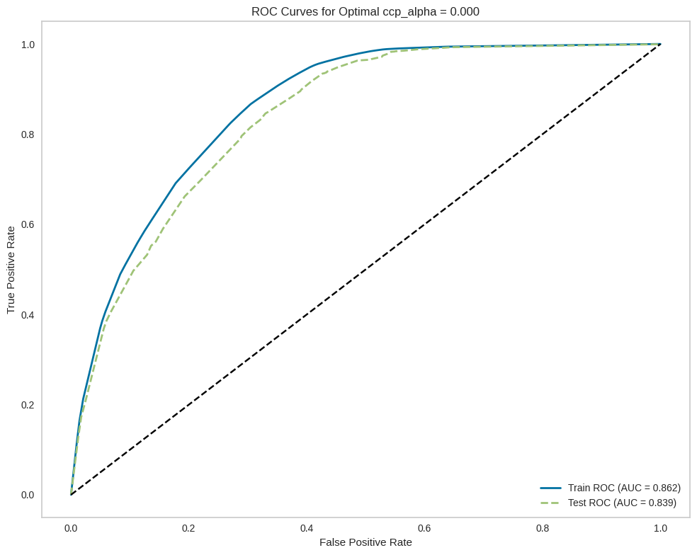
Krivky ROC pre tréningové a testovacie dáta sú podobné. Prerezaný model si zachováva konzistentný výkon na rôznych dátach.
- **AUC pre testovaciu množinu**: Prerezaný model dosahuje AUC = 0.839, čo je vyššia hodnota v porovnaní s AUC neorezaného modelu (0.808).
- Rozdiel medzi AUC na tréningových dátach (0.862) a testovacích dátach (0.839) je malý, čo ukazuje, že prerezaný model nie je výrazne pretrénovaný.

### Porovnanie výsledkov prerezaného a neprerezaného stromu

| Metrika                  	 | Neorezaný strom | Prerezaný strom | Zmena |
|---------------------------|------------------|------------------|-------|
| Tréningová presnosť       | 74.6 %           | 74.0 %           | Mierny pokles v presnosti |
| Testovacia presnosť       | 69.6 %           | 71.9 %           | Zlepšenie presnosti na testovacích dátach |
| Precision (trieda 1)      | 0.46             | 0.48             | Mierne zlepšenie |
| Recall (trieda 1)         | 0.87             | 0.83             | Mierny pokles citlivosti |
| F1-score (trieda 1)       | 0.60             | 0.61             | Mierne zlepšenie |

### Záver
- Prerezaný strom dosahuje vyššiu presnosť na testovacích dátach, čo naznačuje, že sa lepšie generalizuje na nové dáta.
- Prerezaný strom má mierne nižšiu presnosť na tréningových dátach, čo je znakom eliminácie nadmerného prispôsobenia trénovacím dátam.
- F1-score pre populárne skladby sa mierne zlepšilo, čo naznačuje lepší kompromis medzi presnosťou a citlivosťou.
- Prerezanie stromu znížilo citlivosť (recall) pre populárne skladby, ale zlepšilo presnosť a generalizáciu.

---

## KNN Regresia

V tejto časti sme použili regresný model K-Nearest Neighbors (KNN) na predikciu popularity skladieb. Začali sme tým, že sme z datasetu odstránili nepotrebné stĺpce, ako sú názvy interpretov, ID skladieb a binarizovanú popularitu.

Pre lepšie výsledky predikcie sme využili nasledujúce metódy:

*   **StandardScaler** - Škálovanie číselných premenných, aby sme zabezpečili rovnakú váhu všetkých vstupných premenných. Obzvlášť dôležité pri KNN, kde vzdialenosti medzi bodmi zohrávajú kľúčovú úlohu.
*   **PCA** - Redukcia rozmerov dát, aby sme udržali 95 % pôvodného rozptylu dát. Tento krok pomohol znížiť počet vstupných premenných a zároveň zlepšil výpočtovú efektivitu modelu bez výraznej straty informácií.
*   **GridSearchCV** - Optimalizácia hyperparametrov modelu s 5-násobnou krížovou validáciou. Hľadali sme najlepšie hodnoty pre počet susedov a váhovú funkciu.

### Výsledky
KNN regresný model dosiahol najlepší výsledok pri hodnote `n_neighbors = 30`. Konkrétne dosiahol **MSE = 261,81** a **R² = 0,50**, čo znamená, že model dokáže vysvetliť 50 % variability v dátach. Iba 25,95 % predikcií sa nachádzalo v tolerancii ±5 od skutočných hodnôt, čo naznačuje, že model má priestor na zlepšenie presnosti predikcií. V porovnaní s lineárnou regresiou dosiahol KNN veľmi podobné výsledky.

Pri porovnaní výkonu na tréningovej a testovacej sade vidíme, že model KNN má problém s pretrénovaním, čo je evidentné z výrazného rozdielu medzi výkonom na tréningovej a testovacej sade. Na tréningových dátach model dosahuje vynikajúce výsledky s veľmi nízkym MSE a vysokou presnosťou, zatiaľ čo na testovacej sade je výkon slabší. To naznačuje, že model sa príliš prispôsobil špecifikám tréningových dát a nedokáže sa dobre generalizovať. Zníženie počtu susedov nepomohlo, ba naopak, chyba na testovacích dátach sa ešte zvýšila.

Na zlepšenie výkonu modelu by bolo vhodné napríklad pridanie nových premenných, ktoré by mali silnejšiu koreláciu s hodnotami popularity, čím by lepšie zvládali variabilitu dát a pomohli by predísť pretrénovaniu.

| Metric                        | Test Set | Training Set | 
|-------------------------------|----------|--------------|
| **Mean Squared Error (MSE)**   | 261.81   | 1.05         |
| **R-squared (R²)**             | 0.50     | 1.00         |
| **Accuracy within ±5**         | 25.95%   | 99.60%       |

---

## KNN Klasifikácia

V druhom prístupe vyhodnocovania popularity pomocou KNN sme zvolili klasifikačný model. Tento model predikuje popularitu skladieb ako binárnu hodnotu, kde skladba buď patrí do top 25% (populárne), alebo nie (nepopulárne).
Postup bol podobný ako pri regresnom modeli, no hlavná zmena spočíva v spôsobe vyhodnocovania modelu. Pri regresnom modeli sme používali MSE, zatiaľ čo pri klasifikácii sme vyhodnocovali model pomocou **accuracy**, **recall** či **precision**.

V tomto prístupe sme tiež použili:
- **StandardScaler** na škálovanie dát.
- **GridSearchCV** na optimalizáciu hyperparametrov. Parametre sme optimalizovali dvomi spôsobmi: raz pre **accuracy** a raz pre **recall**.

### Výsledky

#### Accuracy Model (`n_neighbors = 60`):
Model optimalizovaný na presnosť dosiahol výborné výsledky:
- **Presnosť (Accuracy)**: 78.62%
- **ROC AUC skóre**: 0.83
Tieto výsledky naznačujú, že model sa celkovo dobre vyrovnáva s rozlišovaním medzi populárnymi a nepopulárnymi skladbami. Vyššie ROC AUC skóre znamená, že model je veľmi efektívny pri rozlišovaní medzi triedami, aj keď nie všetky populárne skladby sú správne identifikované.

#### Recall Model (`n_neighbors = 5`):
Model zameraný na **recall** dosiahol:
- **Recall**: 49.71%
- **F1 skóre**: 52.62%
Aj keď bol tento model optimalizovaný na recall, výsledky sú len mierne lepšie pri zachytávaní populárnych skladieb. Model stále nevykazuje výrazné zlepšenie oproti modelu optimalizovanému na presnosť.

### Porovnanie Metód

| **Metric**             | **Accuracy Model** (`n_neighbors = 60`) | **Recall Model** (`n_neighbors = 5`) |
|-------------------------|-----------------------------------------|---------------------------------------|
| **Best Hyperparameters**| `{'n_neighbors': 60}`                  | `{'n_neighbors': 5}`                 |
| **Accuracy**            | 78.62%                                | 76.20%                               |
| **Precision**           | 62.61%                                | 55.88%                               |
| **Recall**              | 48.62%                                | 49.71%                               |
| **F1 Score**            | 54.74%                                | 52.62%                               |
| **ROC AUC Score**       | 0.83                                  | 0.79                                 |
| **Confusion Matrix**    | `[[3848, 452], [800, 757]]`            | `[[3689, 611], [783, 774]]`          |

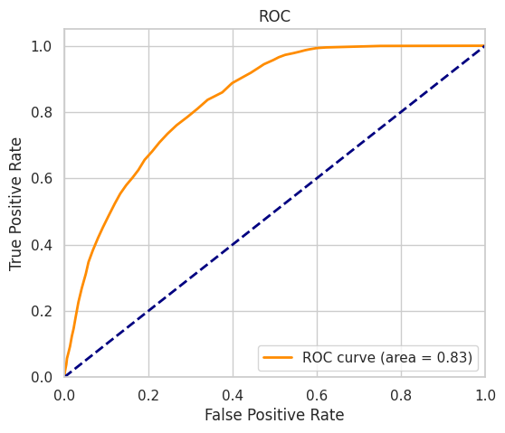
### Zhodnotenie
Hodnota **AUC = 0.83** znamená, že pravdepodobnosť správnej klasifikácie pozitívneho a negatívneho príkladu je 83 %. To poukazuje na dobrú schopnosť modelu rozlišovať medzi triedami, no stále existuje priestor na zlepšenie.

---

# Porovnanie a Výsledky

V tejto časti sa zameriame na porovnanie výkonnosti všetkých vyššie naprogramovaných modelov.

Keďže máme modely, ktoré sa zameriavajú na rôzne typy predikcií – jeden na popularitu ako nebinárnu veličinu a druhý na binárnu hodnotu – budeme tieto dve skupiny hodnotiť samostatne a následne ich porovnáme pomocou presnosti. Celkovo by sme zhodnotili kvalitu nebinárnych modelov ako nedostatočujúcu. Accuracy sa pohybuje len okolo 25 % pri tolerancii ±5. Avšak ak zvýšime toleranciu, tak sa aj výrazne zvýši accuracy. Preto by tieto modely mohli byť užitočné aspoň pre hrubý odhad.

### Nebinarna Klasifikacia Popularity

| Model               | MSE na test_df | Accuracy  |
|---------------------|----------------|-----------|
| Lineárna Regresia   | 256.17         | 25.7 %    |
| KNN                 | 261.81         | 25.95 %   |

### Výhody nebinárnych modelov:
- Jednoduchá interpretácia a implementácia
- Potenciál na presné predikovanie pre lepšie datasety
- Môžeme použiť, keď je potrebné odhadnúť presnú hodnotu
- Môžu ukázať presné vzťahy medzi premennými (regresia)

### Nevýhody nebinárnych modelov:
- Slabé pre nekorelované premenné (nemajú lineárne závislosti)
- Accuracy silno závisí od škály predikcií a nastavenej tolerancie

### Binárna Klasifikácia Popularity

| Model                | ROC AUC | Accuracy  | Precision (trieda populárne pesničky) | Recall (trieda populárne pesničky) | F1-score (trieda populárne pesničky) |
|----------------------|---------|-----------|--------------------------------------|-------------------------------------|---------------------------------------|
| Logistická Regresia  | 81%     | 73%       | 55%                                  | 75%                                 | 63%                                   |
| KNN                  | 83%     | 78.62%    | 63%                                  | 49%                                 | 60% |
| Rozhodovací Strom    | 83.9%   | 71.9%     | 48%                                  | 83%                                 | 61%                                   |

Celkovo najvyššiu accuracy a precision dosiahol model KNN. Napriek tomu však výrazne zaostáva v hodnote F1 score, ktoré kombinuje hodnoty recalla a precision. Tento parameter považujeme za dôležitý, keďže je naším cieľom správne predikovať populárne skladby ako populárne. Preto za najvhodnejšie modely považujeme logistickú regresiu a rozhodovací strom, keďže rozdiely medzi nimi sú veľmi malé. Celkovo ich hodnotíme ako dobré, vyše 70 % skladieb dokážu správne klasifikovať.
 
 Na základe našich výsledkov odporúčame pre klasifikáciu popularity piesní použiť binárne modely, konkrétne **logistickú regresiu** alebo **rozhodovací strom**. Výber medzi týmito dvoma modelmi závisí od konkrétnych požiadaviek na presnosť a interpretáciu výsledkov.

### Výhody:
- Jednoduchá interpretácia
- Pomerne vysoká presnosť

### Nevýhody:
- Zjednodušovanie problému (strata informácií)

---

# Odpoveď na hlavné otázky

1. **Závisí popularita od interpreta?**

   Túto otázku sme si položili hneď na začiatku, keď sme sa rozhodovali, akým spôsobom budeme pracovať s kategorickou premennou „meno interpreta“. Zavedenie dummy premenných by bolo neefektívne, a takisto by bolo nesprávne úplne vyhodiť túto premennú, keďže sme vychádzali z predpokladu, že meno interpreta má silný vplyv na popularitu skladby. Problém sme vyriešili tak, že namiesto mena interpreta sme zaviedli **rank**, ktorý predstavuje umiestnenie interpreta v rebríčku podľa celkových streamov.

   Na vizualizáciu korelácie sme použili klasický scatter plot, ktorý zobrazuje vzťah medzi popularitou skladieb a hodnotením interpreta. Spearmanov korelačný koeficient 0,39 ukazuje na miernu pozitívnu koreláciu medzi týmito premennými. Aj keď táto závislosť nie je veľmi silná, naznačuje, že populárnejší interpreti majú tendenciu dosahovať vyššiu popularitu svojich skladieb. Rozptýlenie bodov v grafe však naznačuje, že aj menej populárni interpreti môžu mať úspešné skladby, a naopak, populárni interpreti nemusia vždy dosiahnuť najvyššiu popularitu so všetkými svojimi skladbami.

   Rovnako aj pri lineárnej regresii vyšiel pozitívny koeficient pre artist_rank (4,28), čo potvrdzuje, že hodnotenie interpreta zohráva úlohu pri určovaní popularity skladieb, aj keď nie je jediným faktorom.

   Keď sa nad tým zamyslíme, popularita skladby a popularita interpreta v realite ani nemôže byť úplne úzko previazaná. Ak by tomu tak bolo, každý populárny interpret by vydával výhradne len populárne skladby. Tento predpoklad však nie je reálny. Populárny interpret môže dosahovať vysoké počty streamov alebo mať silnú fanúšikovskú základňu, ale len malý podiel jeho skladieb sa stane hitmi. Zvyšok produkcie môže byť menej známy alebo menej úspešný, aj keď stále patrí do portfólia známeho interpreta.

   Celkovo je jasné, že medzi popularitou interpreta a popularitou skladby existuje len určitá korelácia. Rozličné faktory, ako sú aktuálne hudobné trendy, marketingové kampane alebo spolupráce s inými umelcami, môžu spôsobiť, že aj menej populárne skladby od známych interpretov môžu byť úspešné. Naopak, niektoré ich populárne skladby nemusia dosiahnuť rovnaký úspech.

---

2. **Od akých parametrov závisí popularita?**

Analýza ukázala, že popularitu skladieb ovplyvňuje kombinácia viacerých faktorov. Pozitívne korelujúce faktory zahŕňajú **rank umelca**, **hlasitosť**, **danceability** (vhodnosť na tanec) a **energia**. Tieto vlastnosti zvyšujú šancu skladby stať sa populárnou. Naopak, **akustickosť**, **inštrumentálnosť**, **valence** (emocionálna náplň skladby) a **liveness** (prvky živého vystúpenia) majú skôr negatívny vplyv.

#### Korelačné Výsledky (Spearmanova Korelácia)
- **Pozitívne faktory**: hlasitosť (0.58), danceability (0.48), rank umelca (0.39).
- **Negatívne faktory**: akustickosť (-0.47), inštrumentálnosť (-0.40), liveness (-0.03).

#### Lineárna Regressia: Kľúčové Koeficienty
- Najvýraznejšie pozitívne vplyvy: hlasitosť (9.75), danceability (5.16), rank interpreta (4.28).
- Najvýraznejšie negatívne vplyvy: valence (-3.98), liveness (-2.32), akustickosť (-1.84).

Skladby, ktoré sú hlasité, tanečné a od známych interpretov, majú väčšiu šancu stať sa populárnymi. Negatívne faktory, ako akustickosť a inštrumentálnosť, môžu popularitu obmedziť. Celkovo však slabé korelácie a nízka presnosť regresných modelov naznačujú, že popularita skladieb je výsledkom komplexných vzťahov, ktoré tieto modely nedokázali plne zachytiť.

---
3. **Ktorý model je lepší na predikciu (binárne/nebinarne) a ktorý model je najlepší?**

   Výsledky jasne ukázali **výhodu binárnych modelov** pre túto konkrétnu úlohu. Nebinárne modely (lineárna regresia, KNN) nedokázali presne predikovať popularitu. Ukázalo sa nám, že v tejto téme je veľmi náročné presne predikovať len na základe faktorov, ktoré máme k dispozícii. Na tento účel sme našli postačujúcu predpoveď iba v prípade, či bude hudba populárna alebo nie. Na základe toho naše binárne modely (logistická regresia, rozhodovací strom, KNN) dosiahli výrazne vyššiu presnosť a lepšie zachytili cieľovú triedu.
---

# Ďalšie vylepšenia, ktoré by malo zmysel aplikovať

1. Kombinácia modelov - Vytvorenie modelu, ktorý by skombinoval výstupy viacerých modelov,čím by sme získali výhody každého z nich.
* Napríklad by sme mohli skombinovať predikcie Logistickej regresie, KNN a Rozhodovacieho stromu. Každý model by zahlasoval a výsledná predikcia by bola tá, ktorá by získala väčšinu hlasov.

2. Hybridný model binárnej a nebinárnej predikcie
* Krok 1: Použijeme binárny model (napr. Logistickú regresiu alebo rozhodovací strom), aby identifikoval, či je pesnička populárna alebo nie.
* Krok 2: Na pesničky označené ako populárne aplikujeme nebinárny model (napr. KNN alebo Lineárnu regresiu), ktorý predpovedá presné percento popularity.

